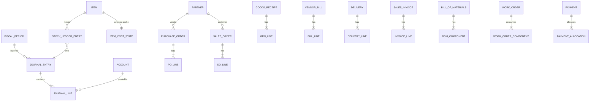

# Manufacturing ERP · 製造業 ERP

[繁體中文](README.md) · **English**

> A from-scratch **manufacturing ERP** (portfolio project). Its soul is a hand-written **double-entry
> General Ledger**: every business action — goods receipt, production, shipment, payment — posts a
> balanced journal entry **in the same database transaction** as the document and inventory change.
> Nothing is ever half-posted; an unbalanced entry cannot be committed. Now with a full-stack coat:
> a React frontend and a one-command `docker compose` demo.

<p align="center"></p>

[](https://erp.terrychou.com)
[](https://github.com/q86865511/ERPSystem/actions/workflows/ci.yml)
[](https://github.com/q86865511/ERPSystem/actions/workflows/ci.yml)
[](https://github.com/q86865511/ERPSystem/actions/workflows/codeql.yml)
[](https://github.com/q86865511/ERPSystem/actions/workflows/security.yml)
[](pom.xml)
[](pom.xml)
[](compose.yaml)
[](frontend/package.json)
[](frontend/package.json)
[](frontend/package.json)
[](compose.demo.yaml)

<p align="center"></p>

> **Why build from scratch instead of extending Odoo/ERPNext?** Because the deliverable is evidence of
> *architecture and ERP-domain literacy* — a posting engine with a hard debit=credit invariant, an
> immutable inventory subledger that reconciles to a GL control account, and a
> document → inventory → ledger pipeline defensible line by line. Extending a packaged ERP would mostly
> demonstrate framework configuration.

**Status**: **Phase 0–7 complete + full-stack**. The modular-monolith backend (double-entry GL,
inventory, procure-to-pay, order-to-cash, manufacturing, reporting & period close, RBAC) is green on
`mvn verify` (60 unit + 97 integration); the React frontend covers all 9 modules; and a single
`docker compose -f compose.demo.yaml up --build` brings up **postgres + an auto-seeded backend +
the frontend**. Stage-by-stage delivery is tracked in [PROGRESS.md](PROGRESS.md).

## Table of contents

- [The headline demo — buy → make → sell](#the-headline-demo--buy--make--sell)
- [🖼️ Screenshots](#️-screenshots)
- [✨ Highlights](#-highlights)
- [🚀 Quick start](#-quick-start)
- [🏗️ Architecture](#️-architecture)
- [🖥️ Frontend](#️-frontend)
- [📊 Data model](#-data-model)
- [🧪 Testing](#-testing)
- [🗺️ Roadmap](#️-roadmap)
- [⚠️ Consciously deferred (not gaps)](#️-consciously-deferred-not-gaps)
- [📐 Architecture decision records](#-architecture-decision-records)
- [Document index](#document-index)

## The headline demo — buy → make → sell

One vertical slice exercises the document → inventory → ledger loop three times and lands the
manufacturing differentiator (single-level BOM + Work Order with correct WIP accounting):

1. **Buy** a raw material — Purchase Order → Goods Receipt → Vendor Bill → Payment
2. **Make** a finished good — single-level BOM → Work Order (consume raw into WIP, produce the good)
3. **Sell** it — Sales Order → Delivery (ship at cost) → Invoice (revenue + COGS) → Receipt

Then **prove it**: the *reconciliation health-check* asserts the books are correct — global
`SUM(debit) = SUM(credit)`, inventory subledger value == GL Inventory control balance, AP/AR
subledgers == their control accounts, and every clearing account (GR-IR, Deferred-COGS, WIP) nets to
zero after a complete cycle. This one report is the project's hero artifact.

> After starting the demo, open the **Dashboard** (as any user) to see the reconciliation hero go
> green; `GET /api/reporting/reconciliation` is its data source.

## 🖼️ Screenshots

**Reconciliation health-check dashboard** (books balanced after the seed — subledgers == GL, clearing accounts at zero):

<p align="center"></p>

| Purchasing (P2P) | Manufacturing (WO state machine + schedule Gantt) | Financial statements + analytics |
|---|---|---|
|  |  |  |

**Human Resources (employees / attendance / leave / timesheets / payroll-to-GL) + deeper analytics widgets** (finance analytics / inventory heat treemap / supplier on-time):

| HR dashboard | Payroll → ledger | Inventory heat + supplier on-time |
|---|---|---|
|  |  |  |

**The "Blue Enterprise" redesign** (blue enterprise palette + dark mode + a hand-rolled onboarding tour):

| Dark mode | Onboarding tour (13 steps, one per module landing page) |
|---|---|
|  |  |

> Captured by headless Playwright against a **local production build**, with `/api` mocked from data
> snapshotted off the live demo (see [frontend/scripts/](frontend/scripts/README.md)); covers light/dark,
> every module page, a form modal, and the onboarding tour.

## ✨ Highlights

- **Hand-written double-entry GL with a hard invariant**: `ledger` is the shared kernel exposing a
  published `LedgerPosting` port; every module posts **in the same transaction** as its own writes, an
  unbalanced entry can't commit (a DB deferred-constraint trigger enforces it), and POSTED entries are
  immutable.
- **Modular monolith with CI-enforced boundaries**: single deployable, single PostgreSQL, in-process
  modules whose boundaries are *enforced* with **ArchUnit** — a module reaches another only through its
  published `*.api` port, never its domain/application/web internals.
- **Moving weighted-average inventory subledger**: an append-only `StockLedgerEntry` (DB triggers block
  edits/deletes) reconciles to its GL control account; a fixed lock order (ItemCostState first, journal
  sequence innermost) avoids deadlock; purchase price variance revalues inventory rather than hitting a
  PPV account.
- **Clearing accounts net to zero**: GR-IR (receipt↔bill), Deferred-COGS (delivery↔invoice) and WIP
  (issue↔completion) all return to zero over a complete cycle — verified end-to-end by the
  **reconciliation hero**.
- **Full-stack type safety, money never touches a float**: the backend adds **springdoc-openapi**; the
  frontend generates a **type-safe TS client** from the OpenAPI spec via `openapi-typescript` +
  `openapi-fetch`; `BigDecimal` is serialized as a **JSON string** globally (and `SpringDocUtils` makes
  the spec say `string` too), so neither side does floating-point arithmetic on amounts.
- **Modern frontend**: React 19 + TypeScript + Mantine 9 + Vite 8 + TanStack Query + React Router; a
  feature-oriented structure with RBAC mirroring the backend authorization matrix (UI hints only — the
  backend still enforces).
- **One-command containerized demo**: a standalone nginx container **reverse-proxies `/api`** to the
  backend on a single origin (no CORS); `compose.demo.yaml` brings up postgres + an auto-seeded backend
  + the frontend in one command.
- **Designed with a multi-agent workflow**: the system design was settled via a "6-dimension design →
  integrate → adversarial review" multi-agent process; the 8-stage frontend was likewise designed by
  multiple agents and delivered stage by stage.
- **Interactive API docs**: Swagger UI (`/swagger-ui.html`) + OpenAPI 3.1 spec (`/v3/api-docs`),
  Authorize-and-try right inside the demo.

## 🚀 Quick start

**Live demo (nothing to install)**: <https://erp.terrychou.com> (defaults to a read-only `guest`; use a role
account like `admin`/`admin` to try writes. Swagger at `/swagger-ui.html`). Deployment: [docs/DEPLOY.md](docs/DEPLOY.md).

Or run it locally (prerequisite: **Docker** — everything runs in containers, no local JDK/Node):

```bash
# One-command demo: postgres + an auto-seeded backend + the nginx-served frontend
docker compose -f compose.demo.yaml up --build
```

- Frontend: <http://localhost:8081>
- Interactive API docs (Swagger UI): <http://localhost:8081/swagger-ui.html> (get an access token from `POST /api/auth/login`, then click **Authorize**)
- Seeded users (JWT, password == username): `guest` (read-only, the login default), `admin` (all roles), `accountant`, `warehouse`, `sales`
- On startup the app posts a **multi-month, multi-item** buy → make → sell data set through the **real
  services** (dozens of POs/SOs, several work orders, some left unpaid to fill the AR/AP aging buckets,
  a few items below their reorder point) so the dashboards render with depth. `DataSeeder` is idempotent
  — it skips when the demo vendor already exists, so re-running `up` against the kept volume is safe —
  and the reconciliation hero stays green (subledgers == GL, clearing accounts at zero)

> For a fresh dataset: `docker compose -f compose.demo.yaml down -v` to drop the volume, then `up`.

### Local development

```bash
# Backend (Spring Boot Docker Compose auto-starts postgres; see compose.yaml)
./mvnw spring-boot:run

# Frontend (a second terminal)
cd frontend
npm install
npm run dev          # Vite dev server, proxies /api to :8080 → http://localhost:5173

# When the backend API changes, regenerate the type-safe TS client from the running backend
npm run gen:api      # reads openapi/openapi.json; or `npm run spec:pull` to fetch the latest spec first
```

> On Windows the Maven Wrapper needs `powershell` on PATH and `JAVA_HOME` set; see
> [PROGRESS.md](PROGRESS.md) for the exact environment notes.

## 🏗️ Architecture

A **modular monolith**: single deployable, single PostgreSQL, in-process modules whose boundaries are
*enforced* (no module imports another's internals or touches its tables — checked in CI with ArchUnit).
The `ledger` module is the shared kernel exposing a published `LedgerPosting` port; every other module
posts through it **in the same transaction** as its own writes. `inventory` keeps a moving
weighted-average subledger reconciling to a GL control account; `purchasing`+`payments` drive
procure-to-pay (receipt → bill → payment) with GR-IR clearing and an AP subledger; `sales` mirrors it
for order-to-cash (delivery → invoice → receipt) with a Deferred-COGS clearing account and an AR
subledger; `manufacturing` runs single-level BOM → work order → WIP issue/completion at rolled actual
cost. `reporting` is a read-side leaf that composes the others' published ports into the financial
statements and the **reconciliation health-check**, and `iam` enforces RBAC. The frontend is served by
an nginx container that reverse-proxies to the backend on a single origin.

| Module | Responsibility | Published port(s) |
|---|---|---|
| `ledger` | Double-entry GL, posting engine, fiscal periods, trial balance | `LedgerPosting`, `SequenceAllocator`, `GeneralLedgerQuery` |
| `masterdata` | Items, partners, warehouses/locations, posting rules, tax rates | `MasterDataQuery` |
| `inventory` | Moving-average subledger, two-leg movements, revaluation | `StockPosting`, `InventoryQuery` |
| `purchasing` | PO → goods receipt → vendor bill, GR-IR, AP subledger | `PayableDocuments`, `PayablesQuery` |
| `sales` | SO → delivery → invoice → return, Deferred-COGS, AR subledger | `ReceivableDocuments`, `ReceivablesQuery` |
| `manufacturing` | BOM, work orders, WIP issue/completion, reorder report | — |
| `payments` | Customer/vendor payments + allocation (in/out) | — |
| `reporting` | Read-side financial statements + reconciliation health-check + finance analytics (trends/cash-flow/budget) | — |
| `hr` | Employees, departments, positions + attendance / leave / timesheets + payroll posting (HR) | `HrQuery` |
| `iam` | Authentication & role-based authorization | — |

| Layer | Choice |
|---|---|
| Backend | Java 21 + Spring Boot 4.1 |
| Database | PostgreSQL 16 |
| Persistence | Spring Data JPA / Hibernate + Flyway migrations |
| Boundary enforcement | ArchUnit (CI-enforced) |
| Money & quantity | `BigDecimal` value objects — `Money` (`NUMERIC(19,4)`) and `Quantity`/cost (`NUMERIC(19,6)`), never `float`; serialized as JSON **strings** |
| Auth | Spring Security + **JWT** (access in memory + refresh httpOnly cookie), persisted bcrypt users, five roles (ADMIN / ACCOUNTANT / WAREHOUSE / SALES / HR) + read-only guest |
| API docs | springdoc-openapi (OpenAPI 3.1) + Swagger UI (`/swagger-ui.html`) |
| Testing | JUnit + Testcontainers (real Postgres) |
| Frontend | React 19 + TypeScript + Mantine 9 + Vite 8 + TanStack Query + React Router |
| Packaging | Multi-stage Dockerfiles (backend & frontend); nginx reverse proxy; `compose.demo.yaml` one-command demo |

## 🖥️ Frontend

`frontend/` is a standalone Vite project (not part of the Maven build). Its data layer uses
**`openapi-typescript`** (types generated from the spec) + **`openapi-fetch`** (a type-safe client whose
middleware injects the JWT Bearer token + retries once on 401 after a silent refresh, and parses RFC 9457
ProblemDetail) + **TanStack Query**; routing is React
Router; UI is Mantine 9. RBAC mirrors the backend's POST authorization matrix as UI hints only
(hide/disable buttons) — the backend still enforces.

It covers all 9 modules:

- **Dashboard** — KPI tiles (revenue / net income / orders / receivables / inventory value) + an order-pipeline funnel + an inventory donut + alerts + the reconciliation health-check hero (subledgers vs GL, clearing accounts at zero)
- **Reports** — trial balance (click an account to drill into its ledger), income statement, balance sheet (shared as-of date)
- **Master data** — items / partners / warehouses / locations CRUD + reusable selectors
- **Purchasing** — PO (multi-line + confirm) → goods receipt (partial) → vendor bill (FIFO match status) → payment + AP aging
- **Sales** — SO → delivery → invoice (shows COGS) → receipt → customer return (credit note, dual postings) + AR aging
- **Manufacturing** — BOM authoring, work-order state machine (release/issue/complete/cancel, conditionally enabled), reorder report
- **Inventory** — on-hand lookup, subledger reconciliation, stock adjustments
- **Ledger** — manual journal entry (live debit=credit check), fiscal-period close/reopen, year-end close (carry P&L to retained earnings, lock the year)
- **Human Resources** — employees / departments / positions master data + **attendance / leave (approval workflow) / timesheets (submit → approve) / payroll (calculate → post one balanced entry to the GL: Dr 6100 / Cr 2200+2210+2220)** + an HR dashboard (headcount, average salary, headcount-by-department donut, attendance rate, pending leave)

Every document's detail surfaces its posting results (the linked `journalEntryId`, `movementGroupId`,
status transitions) — making this ERP's selling point visible: you can see how the books move.

**Bilingual UI (中／English)**: the "中 / EN" switch in the top bar changes language instantly; the default
**follows the browser** (`zh-*` → Traditional Chinese, otherwise English) and the preference is stored in
localStorage. i18n is a **dependency-free, self-built typed context** — translation keys are type-checked at
compile time (a missing translation in either locale fails the `build`), and the date calendar switches dayjs
locale; money/number formatting and backend codes are intentionally not translated.

**Print / PDF**: sales invoices, purchase orders, delivery notes and the trial balance print in one click
(dedicated A4 print routes + print CSS; the browser's "Save as PDF"), bilingual via the same i18n.

**Journal-entry reversal (correcting entries)**: corrections to the immutable ledger are made by a reversing
entry — one click mirrors a manual entry line-for-line with debit/credit swapped (the original is never
edited; both stay POSTED, linked, and net to zero). Manual entries only (document-sourced entries reverse
through their owning module so subledgers stay equal to GL). Ledger page → "Reversal" tab: enter the entry
number → load detail → confirm.

**Audit trail (ADMIN-only)**: journal postings, period close/reopen and login success/failure are written to
an append-only `audit_log` (domain events + an `AFTER_COMMIT` listener, so only committed actions are
recorded; a DB trigger blocks update/delete). ADMIN users browse the "Audit Trail" page, filterable by event
type and actor.

> 🔵 **"Blue Enterprise" redesign (Phase 1 shipped)**: the frontend has moved from Warm Terracotta to a
> blue enterprise-SaaS look (primary `#2563EB` + a cool slate neutral scale) and is deployed — **the
> screenshots on this page are the blue version**. Four `@mantine/charts` data dashboards (ERP overview /
> finance center / inventory / manufacturing) are wired to real endpoints; finance analytics (revenue trend
> / cash flow / budget variance / KPI deltas, C1), the per-item heat treemap (C2), supplier on-time rate
> (C3), the work-order Gantt (C4) and OEE / equipment (C5) are **all wired to real backends — no PLANNED
> placeholders remain**.

**The design system (Blue Enterprise)**: a self-built Mantine theme — a blue enterprise primary color
(`#2563EB`) + a cool slate neutral scale + a self-hosted Plus Jakarta Sans;
light/dark mode toggles instantly from the top bar (defaults to the OS preference, persisted to
localStorage). The component layer is a global `theme.components` override (tables, cards, inputs, …)
plus shared components (`DataTable`/`DetailDrawer`/`StateButton`/`StatTile`/`KpiTile`/`DonutCard`/`AmountAllocationTable`/
`EmptyState`/an enhanced `PageHeader`) — built as each module actually adopted them, not speculatively.

**Onboarding tour (hand-rolled, no tour library)**: a ~2.5KB spotlight-and-callout overlay covering the
login page's demo accounts, the reconciliation health-check, and **every module's landing page** (13 steps
total). A `MutationObserver` detects which target element is present on the current page, so the tour
continues naturally across navigation (login → dashboard → each module); progress persists to localStorage
and can be restarted anytime from the user menu.

**Observability**: Micrometer exposes metrics at `/actuator/prometheus` (reachable only on the internal
network) — business counters derived from the same domain events (postings/logins/period changes) plus a
reconciliation-health gauge, alongside free HTTP/JVM/pool metrics; structured (ECS) JSON logging and a
per-request correlation id. An optional `docker compose -f compose.demo.yaml -f compose.observability.yaml up`
brings up Prometheus + Grafana with a preloaded dashboard. See [docs/OBSERVABILITY.md](docs/OBSERVABILITY.md).

**Testing**: 97 backend Testcontainers integration tests + ArchUnit boundaries + reconciliation/year-end
acceptance (`mvn verify`); frontend Vitest + React Testing Library (BigInt money math, the RBAC matrix, i18n,
the **single-flight 401→refresh→replay** JWT flow, the `RequireRole` guard) run in CI after every build; a
Playwright chromium smoke runs in a separate non-blocking `e2e` workflow against the live demo.

## 📊 Data model

The accounting spine (accounts, balanced journal entries, fiscal periods) is the centre; every business
document links its postings back to a journal entry, and inventory movements are an append-only
subledger that reconciles to the GL.



## 🧪 Testing

```bash
# Backend: unit tests (Surefire) + Testcontainers integration tests (Failsafe, real Postgres)
./mvnw verify       # 60 unit + 97 integration; CI runs `./mvnw -B -ntp verify`

# Frontend: type-check + bundle
cd frontend && npm run build      # tsc -b && vite build
```

Integration tests are named `*IT` (run by Failsafe in `verify`); `mvn test` only runs `*Test`/`*Tests`.
Use `mvn verify` for the full suite; GitHub Actions CI already does. `OpenApiSpecIT` additionally guards
OpenAPI-spec invariants (no schema-name collisions, money typed as string, no merged `oneOf` operations).

## 🗺️ Roadmap

**✅ Phase 0–6 (backend)**: Phase 0 walking skeleton (ledger spine) → 1 products & inventory
(moving weighted-average, subledger reconciliation) → 2 procure-to-pay (GR-IR, Input VAT, variance
revaluation, AP subledger) → 3 order-to-cash (Deferred-COGS, returns/credit notes, AR subledger) →
**4 manufacturing (single-level BOM, work orders, WIP actual-cost roll-up — minimum show-worthy
milestone)** → 5 reporting & period close (financial statements, reconciliation hero, soft-close; later a hard-close year-end with retained-earnings carry-forward) →
6 polish & packaging (RBAC, one-key seed, README/ADRs).

**✅ Phase 7 (full-stack)**: backend enablement (springdoc, `/api/auth/me`, BigDecimal-as-string,
read-only list endpoints per module) + a React frontend (8 stages: skeleton → master data →
dashboard/reports → purchasing → sales → manufacturing → advanced → containerization) + a one-command
`docker compose` demo.

**✅ The "Warm Terracotta" UI/UX redesign**: a site-wide theme + `theme.components` override layer (warm
terracotta primary, warm-gray neutral scale, self-hosted font), 7 shared components built as adopted, an
8-module page-by-page polish pass, a hand-rolled onboarding tour (13 steps covering every module's landing
page), and an accessibility sweep (every icon-only control has an `aria-label`; Modals/Drawers rely
throughout on Mantine's built-in focus-trap). Delivered as 12 PRs (`#62`–`#73`); design spec at
[docs/superpowers/specs/2026-06-30-warm-terracotta-redesign-design.md](docs/superpowers/specs/2026-06-30-warm-terracotta-redesign-design.md).

**✅ The "Blue Enterprise" redesign (Phase 1)**: the site-wide primary color moved from Warm Terracotta to a
blue enterprise look (`#2563EB` + cool slate), introducing `@mantine/charts` and shared chart components
(`KpiTile` / `DonutCard`); it delivered four data dashboards wired to real endpoints (ERP overview / finance
center / inventory / manufacturing), a collapsible nested nav + URL-driven tabs, and re-shot every screenshot
in blue (`#76`, `#77`). Deeper data widgets (treemap / Gantt / OEE / supplier on-time / cash-flow /
budget-variance) are queued as later backend PRs.

## ⚠️ Consciously deferred (not gaps)

Multi-currency/FX, multi-tenancy (never), FIFO/standard-cost variances, a tax engine beyond one VAT
line, approval workflows, full time-phased MRP, lot/serial tracking, routings/work-centers/labor,
multi-warehouse transfers, multi-level BOM.
**Security**: **JWT (access + refresh) + a persisted bcrypt user/role store**, replacing the earlier HTTP
Basic + in-memory users; the access token lives in memory and the refresh token in an httpOnly cookie (silent
refresh on reload), and the public demo defaults to a read-only guest. Revocable refresh (DB rotation) and a
user-management UI remain future work.

## 📐 Architecture decision records

The senior-signal decisions, each written up under [docs/adr/](docs/adr/):

1. [Modular monolith](docs/adr/0001-modular-monolith.md) — enforced boundaries over microservices.
2. [Moving-average valuation](docs/adr/0002-moving-average-valuation.md) — perpetual weighted average, no PPV.
3. [Cross-module posting & locking](docs/adr/0003-cross-module-posting-and-locking.md) — synchronous posting in one transaction; fixed lock order.
4. [GR-IR clearing & three-way match](docs/adr/0004-gr-ir-clearing-and-three-way-match.md) — goods-received-not-invoiced nets to zero.
5. [Purchase price variance → inventory](docs/adr/0005-purchase-price-variance-to-inventory.md) — variance revalues inventory, no PPV account.
6. [Deferred COGS](docs/adr/0006-deferred-cogs.md) — recognise cost at invoicing, the sales-side mirror of GR-IR.
7. [Manufacturing WIP & actual-cost roll-up](docs/adr/0007-manufacturing-wip-and-actual-cost-rollup.md) — WIP clears to zero; finished goods at rolled actual cost.
8. [RBAC via request authorization](docs/adr/0008-rbac-url-authorization.md) — four roles enforced at the single REST entry point.
9. [Year-end close](docs/adr/0009-year-end-close.md) — closing entry zeroes P&L into retained earnings (3200); periods hard-locked.
10. [Journal-entry reversal](docs/adr/0010-journal-entry-reversal.md) — append-only corrections via a mirror reversing entry; manual entries only, both stay POSTED.

## Document index

| Document | Contents |
|---|---|
| [PROGRESS.md](PROGRESS.md) | Stage-by-stage progress, key decisions, environment notes |
| [docs/superpowers/specs/2026-06-30-warm-terracotta-redesign-design.md](docs/superpowers/specs/2026-06-30-warm-terracotta-redesign-design.md) | The "Warm Terracotta" UI/UX redesign spec (palette, component layer, per-module polish, onboarding tour) |
| [docs/adr/](docs/adr/) | Architecture decision records (ADR 0001–0010) |
| [docs/DEPLOY.md](docs/DEPLOY.md) | Deployment: local one-command demo + cloud subdomain (Cloudflare Tunnel + Caddy) |
| [compose.demo.yaml](compose.demo.yaml) | One-command demo (postgres + backend + frontend) |
| [frontend/](frontend/) | React frontend (standalone Vite project) |
| [README.md](README.md) | 繁體中文版 |
