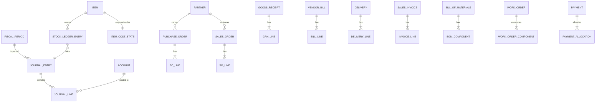

# Manufacturing ERP

[](https://github.com/q86865511/ERPSystem/actions/workflows/ci.yml)

<p align="center"></p>

A from-scratch **manufacturing ERP** built as a portfolio project. Its soul is a hand-written
**double-entry General Ledger**: every business action — goods receipt, production, shipment,
payment — posts a balanced journal entry **in the same database transaction** as the document and
inventory change. Nothing is ever half-posted; an unbalanced entry cannot be committed.

> **Why build from scratch instead of extending Odoo/ERPNext?** Because the deliverable is evidence
> of *architecture and ERP-domain literacy* — a posting engine with a hard debit=credit invariant, an
> immutable inventory subledger that reconciles to a GL control account, and a
> document → inventory → ledger pipeline defensible line by line. Extending a packaged ERP would
> mostly demonstrate framework configuration. (Extending would be the right call for shipping real
> business value fast, or when targeting an explicit Odoo/Frappe role — neither applies here.)

## The headline demo — buy → make → sell

One vertical slice exercises the document → inventory → ledger loop three times and lands the
manufacturing differentiator (single-level BOM + Work Order with correct WIP accounting):

1. **Buy** a raw material — Purchase Order → Goods Receipt → Vendor Bill → Payment
2. **Make** a finished good — single-level BOM → Work Order (consume raw into WIP, produce finished good)
3. **Sell** it — Sales Order → Delivery (ship at cost) → Invoice (revenue + COGS) → Receipt

Then **prove it**: the *reconciliation health-check* asserts the books are correct —
global `SUM(debit) = SUM(credit)`, inventory subledger value == GL Inventory control balance,
AR/AP subledgers == their control accounts, and every clearing account (GR-IR, WIP) nets to zero
after a complete cycle. This one report is the project's hero artifact.

## Architecture

<p align="center"></p>

A **modular monolith**: single deployable, single PostgreSQL database, in-process modules whose
boundaries are *enforced* (no module imports another's internals or touches its tables — checked in
CI with ArchUnit). The `ledger` module is a shared kernel exposing a published `LedgerPosting` port;
every other module posts through it **in the same transaction** as its own writes, never reaching into
ledger internals. `inventory` keeps a moving weighted-average subledger that reconciles to the GL Inventory
control account; `purchasing` and `payments` drive procure-to-pay (receipt → bill → payment) with GR-IR
clearing and an AP subledger; `sales` mirrors it for order-to-cash (delivery → invoice → receipt) with a
Deferred-COGS clearing account and an AR subledger; `manufacturing` runs single-level BOM → work order →
WIP issue/completion at rolled actual cost. The `reporting` module is a read-side leaf that composes the
others' published ports into the financial statements and the **reconciliation health-check**, and `iam`
enforces role-based access control.

The modules and their published ports:

| Module | Responsibility | Published port(s) |
|---|---|---|
| `ledger` | Double-entry GL, posting engine, fiscal periods, trial balance | `LedgerPosting`, `SequenceAllocator`, `GeneralLedgerQuery` |
| `masterdata` | Items, partners, warehouses/locations, posting rules, tax rates | `MasterDataQuery` |
| `inventory` | Moving-average subledger, two-leg movements, revaluation | `StockPosting`, `InventoryQuery` |
| `purchasing` | PO → goods receipt → vendor bill, GR-IR, AP subledger | `PayableDocuments`, `PayablesQuery` |
| `sales` | SO → delivery → invoice → return, Deferred-COGS, AR subledger | `ReceivableDocuments`, `ReceivablesQuery` |
| `manufacturing` | BOM, work orders, WIP issue/completion, reorder report | — |
| `payments` | Customer/vendor payments + allocation (direction in/out) | — |
| `reporting` | Read-side financial statements + reconciliation health-check | — |
| `iam` | Authentication & role-based authorization | — |

See [docs/adr/](docs/adr/) for the architecture decision records (indexed below).

| Layer | Choice |
|---|---|
| Backend | Java 21 + Spring Boot 4 |
| Database | PostgreSQL 16 |
| Persistence | Spring Data JPA / Hibernate + Flyway migrations |
| Boundary enforcement | ArchUnit (CI-enforced) |
| Money & quantity | `BigDecimal` value objects — `Money` (`NUMERIC(19,4)`) and `Quantity`/cost (`NUMERIC(19,6)`), never `float`; serialized as JSON **strings** so clients never apply float arithmetic to amounts |
| API docs | OpenAPI 3.1 via springdoc; interactive Swagger UI at `/swagger-ui.html` |
| Auth | Spring Security + HTTP Basic, role-based (ADMIN / ACCOUNTANT / WAREHOUSE / SALES); stateless JWT deferred |
| Testing | JUnit + Testcontainers (real Postgres) |
| Frontend | React 18 + TypeScript + Mantine *(later phase)* |

## Data model

The accounting spine (accounts, balanced journal entries, fiscal periods) is the centre; every business
document links its postings back to a journal entry, and inventory movements are an append-only subledger
that reconciles to the GL.



## Running it

Prerequisites: **JDK 21**, **Docker** (for the database / Testcontainers).

```bash
# run the test suite (spins a throwaway Postgres via Testcontainers)
./mvnw test

# run the app locally (Spring Boot Docker Compose auto-starts the postgres service)
./mvnw spring-boot:run

# run with the one-key demo seed — posts a full buy -> make -> sell slice through the real
# services on startup, so the books land balanced and the reconciliation health-check is green
./mvnw spring-boot:run -Dspring-boot.run.profiles=seed
```

Seeded users (HTTP Basic): `admin/admin` (all roles), `accountant/accountant`, `warehouse/warehouse`,
`sales/sales`. After seeding, `GET /api/reporting/reconciliation` (as any user) shows the books reconcile.

Interactive API docs are at `http://localhost:8080/swagger-ui.html` (use the **Authorize** button with
`admin`/`admin`); the OpenAPI spec is served at `/v3/api-docs`.

> On Windows the Maven Wrapper needs `powershell` on PATH and `JAVA_HOME` set; see
> [PROGRESS.md](PROGRESS.md) for the exact environment notes used during development.

## Roadmap

**✅ Done:** Phase 0 walking skeleton (ledger spine) · Phase 1 products & inventory (moving weighted-average
valuation, append-only subledger reconciling to the GL Inventory control account) · Phase 2 procure-to-pay
(PO → goods receipt → vendor bill → payment, with GR-IR clearing, Input VAT, a purchase-price variance that
revalues inventory, and an AP subledger that reconciles to its control account) · Phase 3 order-to-cash
(Sales Order → Delivery → Invoice → Receipt, plus customer returns / credit notes). Costs follow a
**deferred-COGS** model mirroring GR-IR: a delivery parks the shipped cost in a Deferred-COGS clearing
account (`Dr 1340 / Cr Finished Goods`); the invoice recognises COGS against it (`Dr COGS / Cr 1340`)
alongside revenue + Output VAT, so a fully shipped-and-invoiced order leaves the clearing account at zero.
The chain reconciles end-to-end (inventory falls, COGS/revenue/Output VAT post, Deferred-COGS and AR net to
zero, trial balance balances, AR subledger == its control account); customer receipts reuse the `payments`
module (`direction IN`), an AR-aging report is exposed, and a customer return posts a credit note that
reverses the whole cycle to zero. · Phase 4 manufacturing (single-level BOM → Work Order → WIP issue →
completion at rolled actual cost, plus work-order cancellation). A work order snapshots its BOM at
release, issues components into WIP (`Dr WIP / Cr component inventory` at moving-average cost), and
completes by receiving finished goods at the rolled cost (`Dr Finished Goods / Cr WIP`, any sub-unit
residual swept to Manufacturing Variance) — so WIP nets to zero over the cycle. A reorder-point report
lists items at or below their reorder point.

**🎉 Minimum show-worthy milestone reached** (end of Phase 4): the full *buy → make → sell* slice runs
end-to-end with the books reconciling at every step.

**✅ Also done:** Phase 5 reporting & period close. A read-side `reporting` module composes the ledger's
published balances into financial statements — a trial balance (as of a date), an income statement, and a
balance sheet whose equity carries current-period earnings (retained earnings computed dynamically, no
year-end close) — plus general-ledger drill-down. It also exposes the **reconciliation health-check** at
`GET /api/reporting/reconciliation` — the project's hero artifact — which composes each module's published
subledger balance with the GL to assert the books are correct: the trial balance balances and the
inventory, AP and AR subledgers each equal their GL control account (with the GR-IR / Deferred-COGS / WIP
clearing accounts reported alongside). Fiscal periods can be **soft-closed** (and reopened) — the posting
service refuses any entry dated in a non-open period.

**✅ Done:** Phase 6 polish & packaging. **Role-based access control** with four roles —
`ACCOUNTANT` (financial postings), `WAREHOUSE` (physical movements & production), `SALES` (sales orders),
`ADMIN` (master data, superuser) — enforced as request authorization over HTTP Basic; reads need only
authentication. A **one-key demo seed** (profile `seed`) posts the entire buy → make → sell slice through
the real services on startup, so a fresh database lands with balanced books. Plus this README pass — the
module map, the data-model ERD above, and the ADR index below.

Full arc: Phase 0 (ledger spine) → 1 products & inventory → 2 procure-to-pay → 3 order-to-cash →
**4 manufacturing (minimum show-worthy milestone)** → 5 reporting & period close → 6 polish & packaging.
Full plan and consciously-deferred scope are tracked in [PROGRESS.md](PROGRESS.md).

### Consciously deferred (deliberate scoping, not gaps)
Multi-currency/FX, multi-tenancy (never), FIFO/standard-cost variances, tax engine beyond one VAT
line, approval workflows, full time-phased MRP, lot/serial tracking, routings/work-centers/labor,
multi-warehouse transfers, multi-level BOM.

## Architecture decision records

The senior-signal decisions, each written up under [docs/adr/](docs/adr/):

1. [Modular monolith](docs/adr/0001-modular-monolith.md) — enforced module boundaries over microservices.
2. [Moving-average valuation](docs/adr/0002-moving-average-valuation.md) — perpetual weighted average, no PPV.
3. [Cross-module posting & locking](docs/adr/0003-cross-module-posting-and-locking.md) — synchronous posting in one transaction; fixed lock order.
4. [GR-IR clearing & three-way match](docs/adr/0004-gr-ir-clearing-and-three-way-match.md) — goods-received-not-invoiced nets to zero.
5. [Purchase price variance → inventory](docs/adr/0005-purchase-price-variance-to-inventory.md) — variance revalues inventory, no PPV account.
6. [Deferred COGS](docs/adr/0006-deferred-cogs.md) — recognise cost at invoicing, the sales-side mirror of GR-IR.
7. [Manufacturing WIP & actual-cost roll-up](docs/adr/0007-manufacturing-wip-and-actual-cost-rollup.md) — WIP clears to zero; finished goods at rolled actual cost.
8. [RBAC via request authorization](docs/adr/0008-rbac-url-authorization.md) — four roles enforced at the single REST entry point.
