# 製造業 ERP · Manufacturing ERP

**繁體中文** · [English](README.en.md)

> 從零自建的**製造業 ERP**(作品集專案)——靈魂是一具手寫的**複式記帳總帳**:收貨、生產、出貨、收付款,每個業務動作都與文件、庫存變動**在同一個資料庫交易**裡過出一張借貸平衡的分錄。沒有任何半過帳;不平衡的分錄根本無法 commit。如今再戴上**全端外衣**:React 前端 + 一行 `docker compose` 起整套。

<p align="center">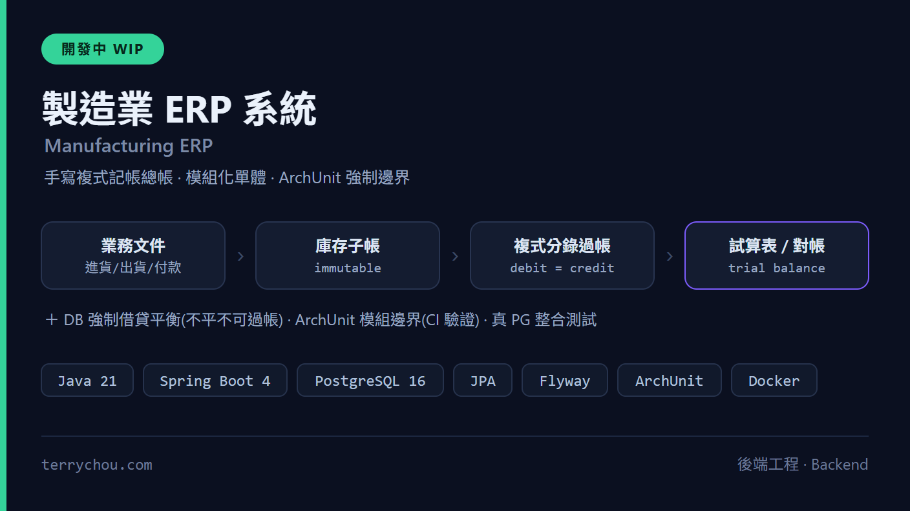</p>

[](https://erp.terrychou.com)
[](https://github.com/q86865511/ERPSystem/actions/workflows/ci.yml)
[](https://github.com/q86865511/ERPSystem/actions/workflows/ci.yml)
[](https://github.com/q86865511/ERPSystem/actions/workflows/codeql.yml)
[](https://github.com/q86865511/ERPSystem/actions/workflows/security.yml)
[](pom.xml)
[](pom.xml)
[](compose.yaml)
[](frontend/package.json)
[](frontend/package.json)
[](frontend/package.json)
[](compose.demo.yaml)

<p align="center">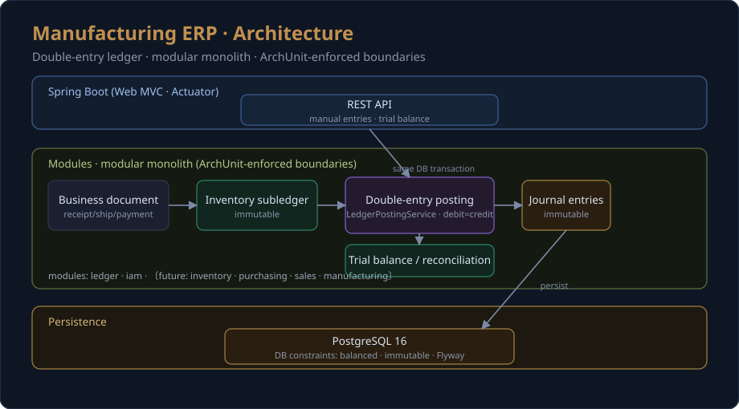</p>

> **為什麼從零自建,而不是擴充 Odoo/ERPNext?** 因為這份作品集要展示的是 *架構與 ERP 領域素養* ——
> 一具帶硬性 `借=貸` 不變量的過帳引擎、一本對帳到 GL 控制科目的不可變庫存子帳,以及一條
> 可逐行辯護的「文件 → 庫存 → 分錄」管線。擴充套裝 ERP 多半只能展示框架設定。

**目前進度**:**Phase 0–7 全數完成 + 全端化**。後端模組化單體(複式總帳 / 庫存 / 採購到付款 / 訂單到收款 / 製造 / 報表與期間結 / RBAC)`mvn verify` 全綠(單元 60 + 整合 97);React 前端覆蓋全部 9 個模組;一行 `docker compose -f compose.demo.yaml up --build` 即可把 **postgres + 自動 seed 的後端 + 前端**整套拉起。逐階段交付見 [PROGRESS.md](PROGRESS.md)。

## 目錄

- [旗艦 demo:買 → 做 → 賣](#旗艦-demo買--做--賣)
- [🖼️ 畫面](#️-畫面)
- [✨ 技術亮點](#-技術亮點)
- [🚀 快速開始](#-快速開始)
- [🏗️ 架構](#️-架構)
- [🖥️ 前端](#️-前端)
- [📊 資料模型](#-資料模型)
- [🧪 測試](#-測試)
- [🗺️ 路線圖](#️-路線圖)
- [⚠️ 刻意切割(非缺漏)](#️-刻意切割非缺漏)
- [📐 架構決策紀錄(ADR)](#-架構決策紀錄adr)
- [文件索引](#文件索引)

## 旗艦 demo:買 → 做 → 賣

一條垂直切片把「文件 → 庫存 → 分錄」迴圈跑三次,並落地製造差異化亮點(單階 BOM + 工單與正確的 WIP 會計):

1. **買**一個原料 —— 採購單 → 收貨 → 廠商帳單 → 付款
2. **做**一個成品 —— 單階 BOM → 工單(領料進 WIP、完工產出成品)
3. **賣**出去 —— 銷售單 → 出貨(以成本出) → 開票(收入 + COGS) → 收款

然後**證明它是對的**:*對帳健康檢查* 斷言帳是平的 —— 全域 `SUM(借) = SUM(貸)`、庫存子帳值 == GL 庫存控制科目餘額、AP/AR 子帳 == 各自控制科目,且每個過渡科目(GR-IR、Deferred-COGS、WIP)在完整循環後都歸零。這張報表是本專案的招牌。

> 啟動 demo 後,以任一帳號開 **儀表板** 即可看到對帳 hero 亮綠燈;`GET /api/reporting/reconciliation` 是它的資料來源。

## 🖼️ 畫面

**對帳健康檢查儀表板**(seed 後帳對平 —— 子帳==GL、過渡科目歸零):

<p align="center">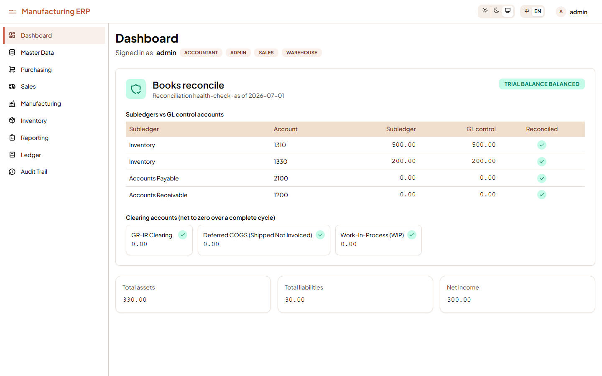</p>

| 採購 P2P | 製造(工單狀態機 + 排程 Gantt) | 財務報表 + 財會分析 |
|---|---|---|
| 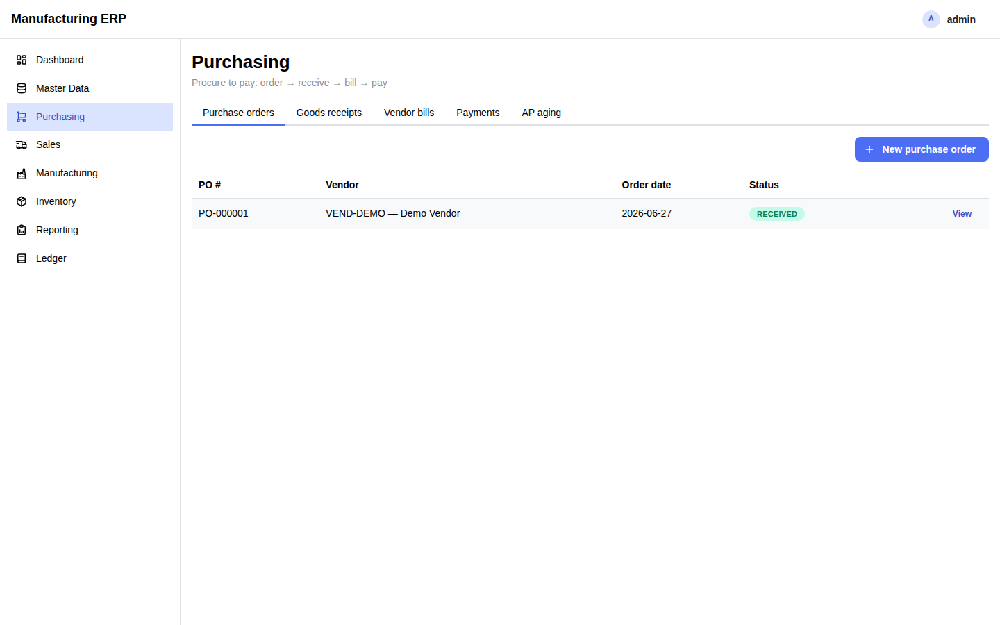 | 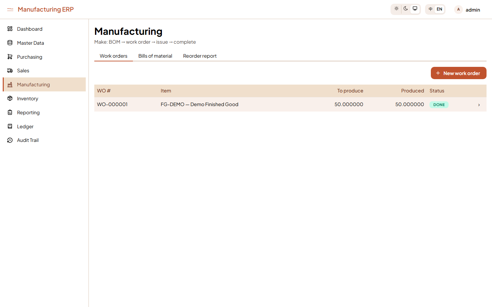 | 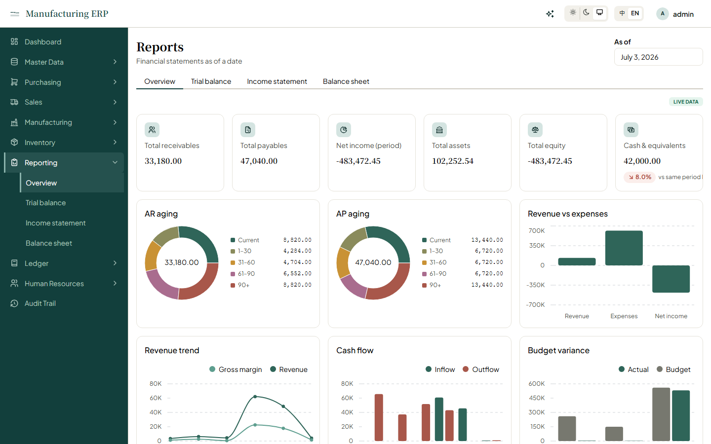 |

**人力資源模組(員工 / 考勤 / 請假 / 工時 / 薪資過帳)+ 深後端分析 widget**(財會分析 / 庫存熱度 treemap / 供應商準時率):

| 人資儀表板 | 薪資 → 總帳 | 庫存熱度 + 供應商準時率 |
|---|---|---|
| 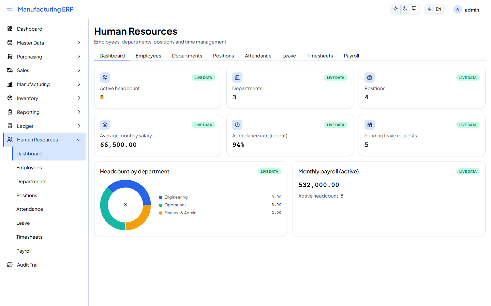 | 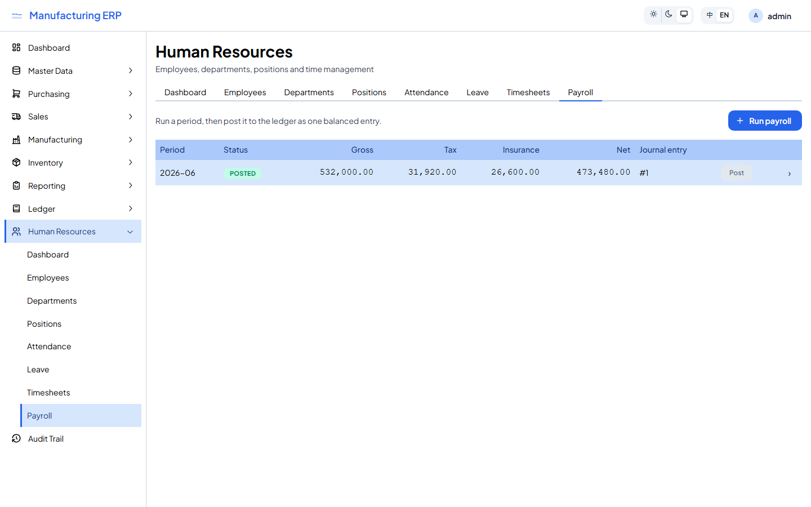 | 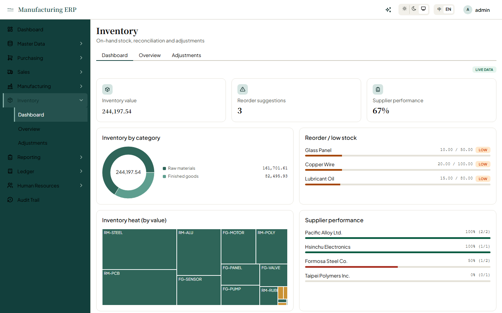 |

**「Blue Enterprise」重設計**(藍色企業主色 + 深色模式 + 手刻新手導覽):

| 深色模式 | 新手導覽(13 步,涵蓋每個模組首頁) |
|---|---|
| 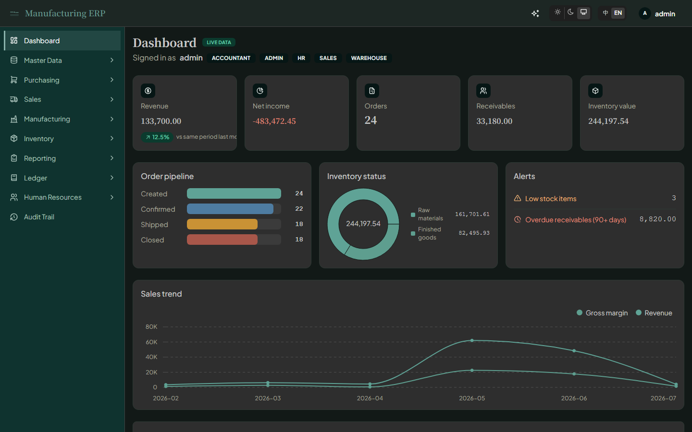 | 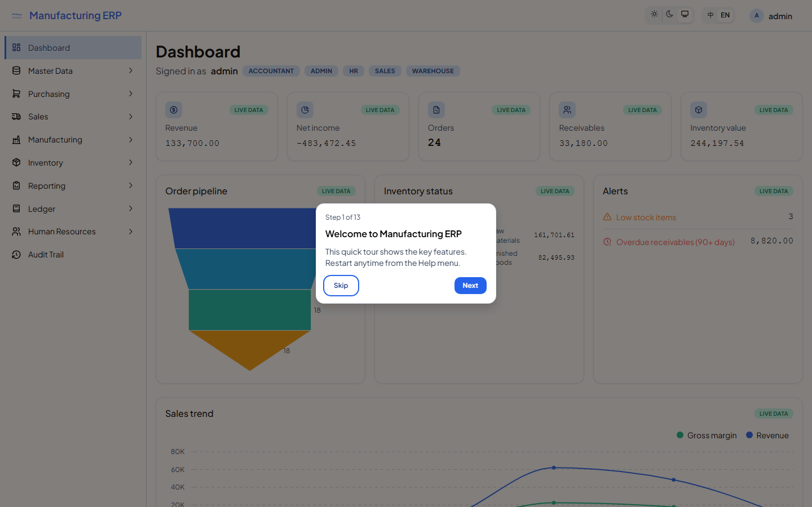 |

> 畫面由 headless Playwright 對**本機 production build** 自動截圖(`/api` 以擷取自 live demo 的資料 mock,見 [frontend/scripts/](frontend/scripts/README.md));深/淺色、各模組頁、開窗與新手導覽皆涵蓋。

## ✨ 技術亮點

- **手寫複式總帳,硬不變量**:`ledger` 是共享核心,暴露 published `LedgerPosting` port;每個模組都在**與自身寫入同一個交易**裡過帳,借貸不平就無法 commit(DB deferred constraint trigger 把關),POSTED 分錄不可改/刪。
- **模組化單體 + CI 強制邊界**:單一部署、單一 PostgreSQL、行程內模組;模組邊界=套件邊界,用 **ArchUnit** 在 CI 強制(模組只能透過他模組的 `*.api` published port 互動,絕不碰 domain/application/web 內部)。
- **移動加權平均庫存子帳**:append-only `StockLedgerEntry`(DB trigger 擋改/刪)對帳到 GL 控制科目;固定鎖序(ItemCostState 先、JE 序號最內層)無死鎖;採購價差走庫存重估而非 PPV 科目。
- **過渡科目對稱清零**:GR-IR(收貨↔請款)、Deferred-COGS(出貨↔開票)、WIP(領料↔完工)三組過渡科目在完整循環後歸零,由**對帳 hero** 一張報表全程驗證。
- **全端型別安全,金額永不碰 float**:後端加 **springdoc-openapi**,前端用 `openapi-typescript` + `openapi-fetch` 從 OpenAPI spec **產生型別安全的 TS client**;`BigDecimal` 全域序列化為 **JSON 字串**(並以 `SpringDocUtils` 讓 spec 同步標 string),前後端都不對金額做浮點運算。
- **現代前端**:React 19 + TypeScript + Mantine 9 + Vite 8 + TanStack Query + React Router;feature 導向結構,RBAC 鏡像後端授權矩陣(僅作 UI 提示,真正強制仍在後端)。
- **一行容器化 demo**:獨立 nginx 容器以**單一 origin 反向代理** `/api` 到後端(免 CORS),`compose.demo.yaml` 一鍵起 postgres + 自動 seed 的後端 + 前端。
- **以多代理工作流設計**:系統設計採「6 維度設計 → 整合 → 對抗式審查」的多代理流程定案;前端 8 階段亦以多代理設計後逐階交付。
- **互動式 API 文件**:Swagger UI(`/swagger-ui.html`)+ OpenAPI 3.1 spec(`/v3/api-docs`),demo 內可直接 Authorize 試打。

## 🚀 快速開始

**線上 demo(免安裝)**:<https://erp.terrychou.com>(預設以唯讀 `guest` 進入;要試寫入用角色帳號如 `admin`/`admin`。Swagger 在 `/swagger-ui.html`)。部署架構見 [docs/DEPLOY.md](docs/DEPLOY.md)。

或在本機跑(前置:**Docker**,全程在容器內,不需裝 JDK/Node):

```bash
# 一鍵 demo:postgres + 自動 seed 的後端 + nginx 前端
docker compose -f compose.demo.yaml up --build
```

- 前端入口:<http://localhost:8081>
- 互動式 API 文件(Swagger UI):<http://localhost:8081/swagger-ui.html>(`POST /api/auth/login` 取 access token,按 **Authorize** 貼上)
- 內建帳號(JWT,密碼=帳號):`guest`(唯讀,登入頁預設)、`admin`(全角色)、`accountant`、`warehouse`、`sales`
- 啟動時會經**真實過帳 service** 灌入**跨數月、多品項/多夥伴**的 買→做→賣(數十筆 PO/SO、多張工單、部分未收/未付款以填滿 AR/AP 帳齡各桶、數個低於安全庫存的品項),讓儀表板有料;`DataSeeder` 為冪等(demo 廠商已存在則跳過,故保留 volume 重跑 `up` 安全),且對帳 hero 仍全綠(子帳==GL、過渡科目歸零)

> 想要全新一份資料時:`docker compose -f compose.demo.yaml down -v` 清掉 volume 再 `up`。

### 本機開發

```bash
# 後端(Spring Boot Docker Compose 會自動起 postgres;見 compose.yaml)
./mvnw spring-boot:run

# 前端(另開一個終端機)
cd frontend
npm install
npm run dev          # Vite dev server,proxy /api 到 :8080 → http://localhost:5173

# 後端 API 有變動時,從執行中的後端重新產生型別安全的 TS client
npm run gen:api      # 讀 openapi/openapi.json;或 npm run spec:pull 先抓最新 spec
```

> Windows 上 Maven Wrapper 需要 `powershell` 在 PATH、且設好 `JAVA_HOME`;細節見 [PROGRESS.md](PROGRESS.md) 的環境備忘。

## 🏗️ 架構

**模組化單體**:單一部署、單一 PostgreSQL、行程內模組,邊界*被強制*(任何模組都不 import 他模組內部、也不碰他模組的表 —— 由 CI 的 ArchUnit 把關)。`ledger` 是共享核心,暴露 published `LedgerPosting` port;其餘模組都透過它**在同一交易**裡過帳。`inventory` 維護移動加權平均子帳並對帳到 GL 控制科目;`purchasing`+`payments` 跑 procure-to-pay(收貨→帳單→付款,含 GR-IR 清算與 AP 子帳);`sales` 鏡像 order-to-cash(出貨→開票→收款,含 Deferred-COGS 與 AR 子帳);`manufacturing` 跑單階 BOM → 工單 → WIP 領料/完工(實際成本滾算)。`reporting` 是 read-side leaf,組合各模組 published port 產出財務報表與**對帳健康檢查**;`iam` 管 RBAC。前端則在 nginx 容器中以單一 origin 反代到後端。

| 模組 | 責任 | Published port(s) |
|---|---|---|
| `ledger` | 複式總帳、過帳引擎、會計期間、試算表 | `LedgerPosting`、`SequenceAllocator`、`GeneralLedgerQuery` |
| `masterdata` | 商品、夥伴、倉庫/儲位、過帳規則、稅率 | `MasterDataQuery` |
| `inventory` | 移動平均子帳、雙腿移動、重估 | `StockPosting`、`InventoryQuery` |
| `purchasing` | PO → 收貨 → 廠商帳單、GR-IR、AP 子帳 | `PayableDocuments`、`PayablesQuery` |
| `sales` | SO → 出貨 → 發票 → 退貨、Deferred-COGS、AR 子帳 | `ReceivableDocuments`、`ReceivablesQuery` |
| `manufacturing` | BOM、工單、WIP 領料/完工、再訂點 | — |
| `payments` | 客戶/廠商收付款 + 配款(in/out) | — |
| `reporting` | read-side 財務報表 + 對帳健康檢查 + 財會分析(趨勢/現金流/預算) | — |
| `hr` | 員工/部門/職位主檔 + 考勤/請假/工時 + 薪資過帳(HR) | `HrQuery` |
| `iam` | 認證與角色授權 | — |

| 層面 | 選型 |
|---|---|
| 後端 | Java 21 + Spring Boot 4.1 |
| 資料庫 | PostgreSQL 16 |
| 持久化 | Spring Data JPA / Hibernate + Flyway migrations |
| 邊界強制 | ArchUnit(CI 強制) |
| 金額與數量 | `BigDecimal` value object —— `Money`(`NUMERIC(19,4)`)、`Quantity`/cost(`NUMERIC(19,6)`),絕不用 `float`;JSON 序列化為**字串** |
| 認證 | Spring Security + **JWT**(access 記憶體 + refresh httpOnly cookie),持久化使用者(bcrypt),5 角色(ADMIN / ACCOUNTANT / WAREHOUSE / SALES / HR)+ 唯讀 guest |
| API 文件 | springdoc-openapi(OpenAPI 3.1)+ Swagger UI(`/swagger-ui.html`) |
| 測試 | JUnit + Testcontainers(真 Postgres) |
| 前端 | React 19 + TypeScript + Mantine 9 + Vite 8 + TanStack Query + React Router |
| 打包 | 後端/前端各自 multi-stage Dockerfile;nginx 反代;`compose.demo.yaml` 一鍵 demo |

## 🖥️ 前端

`frontend/` 是獨立的 Vite 專案(不掛進 Maven build)。資料層用 **`openapi-typescript`**(從 spec 產生型別)+ **`openapi-fetch`**(型別安全 client,middleware 注入 JWT Bearer + 401 自動 refresh 重試、解析 RFC 9457 ProblemDetail)+ **TanStack Query**;路由用 React Router;UI 用 Mantine 9。RBAC 在前端鏡像後端的 POST 授權矩陣,僅作「隱藏/停用按鈕」的提示(真正強制在後端)。

涵蓋全部 9 個模組:

- **儀表板** —— KPI 磚(營收 / 淨利 / 訂單 / 應收 / 在庫值)+ 訂單漏斗 + 庫存甜甜圈 + 警示 + 對帳健康檢查 hero(子帳 vs GL、過渡科目歸零)
- **報表** —— 試算表(點科目開總帳鑽取 Drawer)、損益表、資產負債表(共用 as-of 日期)
- **主檔** —— 商品 / 夥伴 / 倉庫 / 儲位 CRUD + 可複用選擇器
- **採購** —— PO(多行 + 確認)→ 收貨(部分收)→ 廠商帳單(FIFO matchStatus)→ 付款 + AP 帳齡
- **銷售** —— SO → 出貨 → 發票(顯示 COGS)→ 收款 → 客戶退貨(credit note 雙帳)+ AR 帳齡
- **製造** —— BOM 建單、工單狀態機(release/issue/complete/cancel 條件啟用)、再訂點
- **庫存** —— 在庫查詢、子帳對帳、庫存調整
- **總帳** —— 手動分錄(即時借貸平衡檢核)、會計期間關閉/重開、年度結帳(損益轉保留盈餘、鎖定年度)
- **人力資源** —— 員工 / 部門 / 職位主檔 + **考勤 / 請假(核准工作流)/ 工時(提交→核准)/ 薪資(試算 → 過一張平衡分錄到總帳:Dr 6100 / Cr 2200+2210+2220)** + HR 儀表板(在職人數、平均月薪、各部門人數甜甜圈、出勤率、待審請假)

每張文件的詳情都把過帳結果攤開(關聯的 `journalEntryId`、`movementGroupId`、狀態流轉),呼應這個 ERP 的賣點:帳怎麼走,看得見。

**中／英雙語 UI**:右上角「中 / EN」切換器即時切換語言,預設**跟隨瀏覽器**(`zh-*` → 繁中,其餘 → 英文),偏好存於 localStorage。i18n 為**自建的零依賴 typed context** —— 翻譯 key 在編譯期型別檢查(任一語言漏譯直接 `build` 失敗),日期月曆隨語言切 dayjs locale;金額/數字格式與後端代碼不在翻譯面。

**列印 / PDF**:發票、採購單、出貨單、試算表可一鍵列印(專用 A4 列印路由 + print CSS,瀏覽器「另存 PDF」),雙語沿用同一套 i18n。

**分錄沖正(correcting entries)**:不可變帳本的更正以「沖正分錄」為之 —— 對手動分錄一鍵產生一張逐行借↔貸對調的鏡像分錄(原分錄永不編輯,雙方維持 POSTED、互相連結、淨額歸零)。只限手動分錄(子帳來源分錄須經其來源模組沖正,以維持子帳==GL)。Ledger 頁「沖正」分頁:輸入分錄號 → 載入明細 → 確認。

**審計軌跡(ADMIN-only)**:過帳、期間關閉/重開、登入成功/失敗都會寫入 append-only 的 `audit_log`(domain event + `AFTER_COMMIT` 監聽,只記真正 committed 的動作;DB trigger 擋改/刪)。ADMIN 角色可在「審計軌跡」頁依事件類型 / 操作者篩選檢視。

> 🔵 **「Blue Enterprise」重設計(Phase 1 已上線)**:前端已由 Warm Terracotta 換為藍色企業 SaaS 風(主色 `#2563EB` + 冷 slate 中性色)並部署上線,**本頁截圖皆為藍色版**。四張 `@mantine/charts` 資料儀表板(ERP 總覽 / 財務中心 / 庫存 / 生產)已接真實端點;財會分析(營收趨勢 / 現金流 / 預算差異 / KPI 環比,C1)、逐品項熱度 treemap(C2)、供應商準時率(C3)、工單 Gantt(C4)、OEE / 設備(C5)**全部接真實後端 —— 已無 PLANNED 佔位**。

**設計系統(Blue Enterprise)**:自建的 Mantine theme —— 藍色企業主色(`#2563EB`)+ 冷 slate 中性色階 + 自託管 Plus Jakarta Sans;深/淺色模式右上角即時切換(預設跟隨系統,偏好存 localStorage)。元件層採 `theme.components` 全域覆寫(表格、卡片、輸入框等)加上共用元件(`DataTable`/`DetailDrawer`/`StateButton`/`StatTile`/`KpiTile`/`DonutCard`/`AmountAllocationTable`/`EmptyState`/強化版 `PageHeader`)—— 隨模組實際採用而建,不預先造死碼。

**新手導覽(手刻,無 tour 套件)**:~2.5KB 的 spotlight + callout 疊層,涵蓋登入頁示範帳號、對帳健康檢查、以及**每一個模組首頁**(共 13 步);以 `MutationObserver` 偵測目前頁面存在哪個目標元素,能跨頁自然接續(登入 → 儀表板 → 逐一模組),進度存 localStorage,可隨時從右上角使用者選單重新開始。

**可觀測性**:Micrometer 在 `/actuator/prometheus`(僅內部網路可達)暴露指標 —— 複用同一套 domain event 發業務 counter(過帳/登入/期間)+ 對帳健康 gauge,外加免費的 HTTP/JVM/連線池指標;結構化(ECS)JSON 日誌 + 每筆請求的關聯 ID。可選 `docker compose -f compose.demo.yaml -f compose.observability.yaml up` 起 Prometheus + Grafana(預載儀表板)。詳見 [docs/OBSERVABILITY.md](docs/OBSERVABILITY.md)。

**測試**:後端 97 個 Testcontainers 整合測試 + ArchUnit 邊界 + 對帳/年結驗收(`mvn verify`);前端 Vitest + React Testing Library(金額 BigInt 數學、RBAC 矩陣、i18n、**單飛 401→refresh→replay** JWT 流程、`RequireRole` 守衛),CI 每次 build 後跑;Playwright chromium smoke 走非阻斷的 `e2e` workflow(對線上 demo)。

## 📊 資料模型

會計脊椎(科目、平衡分錄、會計期間)是中心;每張業務文件把過帳連回分錄,庫存移動是 append-only 子帳並對帳到 GL。

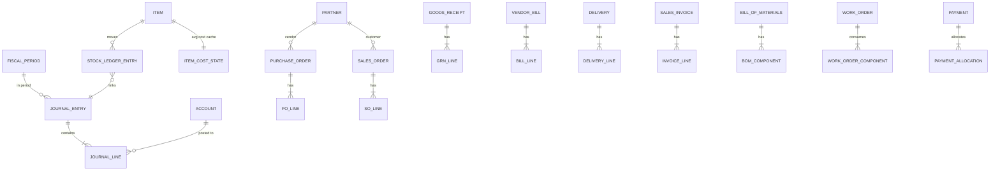

## 🧪 測試

```bash
# 後端:單元測試(Surefire)+ Testcontainers 整合測試(Failsafe,起真 Postgres)
./mvnw verify       # 單元 60 + 整合 97;CI 用 `./mvnw -B -ntp verify`

# 前端:型別檢查 + 打包
cd frontend && npm run build      # tsc -b && vite build
```

整合測試命名為 `*IT`(Failsafe 在 `verify` 跑),`mvn test` 只跑 `*Test`/`*Tests`。請用 `mvn verify` 跑完整測試;GitHub Actions CI 已用 `verify`。`OpenApiSpecIT` 額外守 OpenAPI spec 不變量(無命名衝突、金額型別為字串、無合併 `oneOf` operation)。

## 🗺️ 路線圖

**✅ Phase 0–6(後端)**:Phase 0 walking skeleton(總帳脊椎)→ 1 商品與庫存(移動加權平均、子帳對帳)→ 2 採購到付款(GR-IR、Input VAT、價差重估、AP 子帳)→ 3 訂單到收款(Deferred-COGS、退貨/credit note、AR 子帳)→ **4 製造(單階 BOM、工單、WIP 實際成本滾算 —— 最低可展示里程碑)** → 5 報表與期間結(財務報表、對帳 hero、soft-close;後續加 hard-close 年結與保留盈餘結轉)→ 6 打磨與打包(RBAC 4 角色、一鍵 seed、README/ADR)。

**✅ Phase 7(全端化)**:後端 enablement(springdoc、`/api/auth/me`、BigDecimal-as-string、各模組唯讀列表端點)+ React 前端(8 階段:骨架 → 主檔 → 儀表板/財報 → 採購 → 銷售 → 製造 → 進階 → 容器化)+ 一鍵 `docker compose` demo。

**✅「Warm Terracotta」UI/UX 重新設計**:全站 theme + `theme.components` 元件層覆寫(暖陶土主色、暖灰中性色階、自託管字體)、7 個隨採用而建的共用元件、8 大模組逐頁打磨、手刻新手導覽(13 步,涵蓋每個模組首頁)、a11y 折入(icon-only 控制皆有 `aria-label`,Modal/Drawer 全面延用 Mantine 內建 focus-trap)。分 12 個 PR 交付(`#62`–`#73`),設計 spec 見 [docs/superpowers/specs/2026-06-30-warm-terracotta-redesign-design.md](docs/superpowers/specs/2026-06-30-warm-terracotta-redesign-design.md)。

**✅「Blue Enterprise」重設計(Phase 1)**:全站主色由 Warm Terracotta 換為藍色企業風(`#2563EB` + 冷 slate),導入 `@mantine/charts` 與共用圖表元件(`KpiTile` / `DonutCard`),交付四張接真實端點的資料儀表板(ERP 總覽 / 財務中心 / 庫存 / 生產)、可摺疊巢狀導覽 + URL 驅動分頁,並重拍全部截圖為藍色版(`#76`、`#77`)。更深的資料 widget(treemap / Gantt / OEE / 供應商準時率 / 現金流 / 預算差異)列為後續後端 PR。

## ⚠️ 刻意切割(非缺漏)

多幣別/FX、多租戶(永不)、FIFO/標準成本+變異、單一 VAT 以外的稅引擎、簽核流程、完整時間相位 MRP、批號/序號、工序/工作中心/人工製費、多倉調撥、多階 BOM。
**安全**:**JWT(access + refresh)+ 持久化使用者/角色庫(bcrypt)**,取代早期的 HTTP Basic + in-memory。access token 放前端記憶體、refresh token 放 httpOnly cookie(頁面重載 silent refresh 還原);公開 demo 預設唯讀 guest。未來可加可撤銷 refresh(DB rotation)、使用者管理 UI。

## 📐 架構決策紀錄(ADR)

資深訊號的決策,逐則寫在 [docs/adr/](docs/adr/):

1. [模組化單體](docs/adr/0001-modular-monolith.md) —— 邊界強制的模組化,非微服務。
2. [移動平均估值](docs/adr/0002-moving-average-valuation.md) —— 永續加權平均,無 PPV。
3. [跨模組過帳與鎖序](docs/adr/0003-cross-module-posting-and-locking.md) —— 同一交易同步過帳;固定鎖序。
4. [GR-IR 清算與三方比對](docs/adr/0004-gr-ir-clearing-and-three-way-match.md) —— 已收未請款歸零。
5. [採購價差→庫存](docs/adr/0005-purchase-price-variance-to-inventory.md) —— 差額重估庫存,無 PPV 科目。
6. [Deferred COGS](docs/adr/0006-deferred-cogs.md) —— 開票才認 COGS,銷售側鏡像 GR-IR。
7. [製造 WIP 與實際成本滾算](docs/adr/0007-manufacturing-wip-and-actual-cost-rollup.md) —— WIP 歸零;成品走滾算實際成本。
8. [RBAC 走請求授權](docs/adr/0008-rbac-url-authorization.md) —— 4 角色在單一 REST 入口強制。
9. [年結與保留盈餘結轉](docs/adr/0009-year-end-close.md) —— closing JE 沖平損益轉 3200,鎖期間 hard-close。
10. [分錄沖正](docs/adr/0010-journal-entry-reversal.md) —— append-only 更正以鏡像沖正分錄為之;僅限手動分錄,雙方維持 POSTED。

## 文件索引

| 文件 | 內容 |
|---|---|
| [PROGRESS.md](PROGRESS.md) | 逐階段進度、重要決策紀錄、環境備忘 |
| [docs/superpowers/specs/2026-06-30-warm-terracotta-redesign-design.md](docs/superpowers/specs/2026-06-30-warm-terracotta-redesign-design.md) | 「Warm Terracotta」UI/UX 重新設計 spec(調色盤、元件層、逐模組打磨、新手導覽) |
| [docs/adr/](docs/adr/) | 架構決策紀錄(ADR 0001–0010) |
| [docs/DEPLOY.md](docs/DEPLOY.md) | 部署:本機一鍵 demo + 雲端子網域(Cloudflare Tunnel + Caddy) |
| [compose.demo.yaml](compose.demo.yaml) | 一鍵 demo(postgres + 後端 + 前端) |
| [frontend/](frontend/) | React 前端(獨立 Vite 專案) |
| [README.en.md](README.en.md) | English version |
